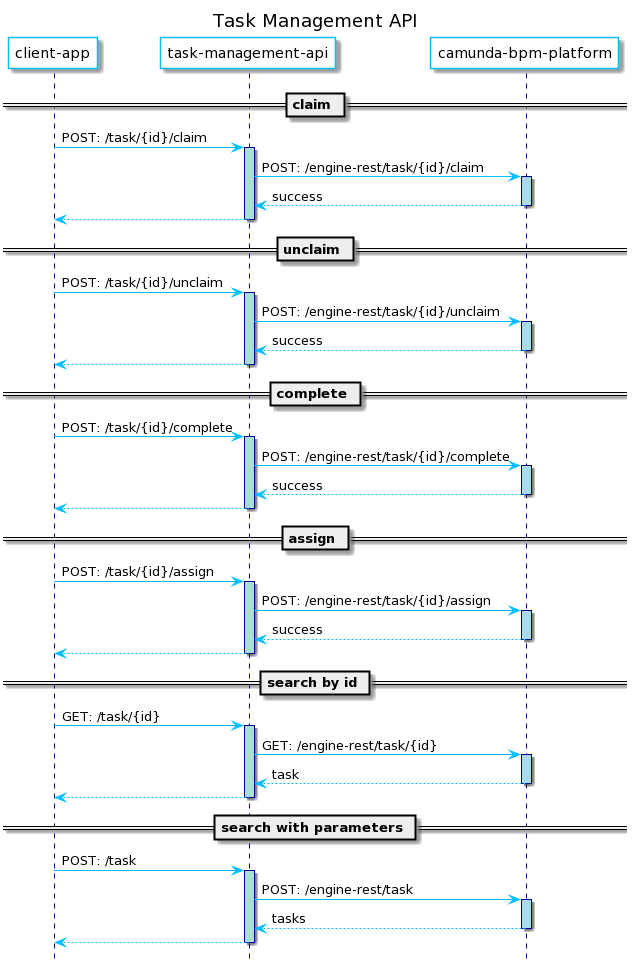
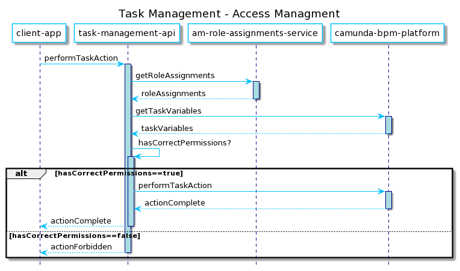

# wa-task-management-api

[](https://travis-ci.org/hmcts/wa-task-management-api)

#### What does this app do?

Provides API endpoints that enable clients manage Tasks in the Camunda Task Database.

<!--
    Sequence Diagram Source:
    http://www.plantuml.com/plantuml/uml/lPLHQzim4CUVSv_Yo9vDdbT8QDfiOz2nGFi5BjB55hPEddHQLag_-vAORKxcCTgaqQF-Vtx7_MJmTLAAcdq3bRECwn1q5Nu0fDf9Iv4yfefis3WfKMFcWuI_PHR3-0IZUOnXSnkQ4771tDxNZpTDvkszqH1lGhGSkzHIh5VxwCwj-Su9_oSbKvSnPB5Tuzty_U9syH56C5fIL6TSIw9zHdz-ltDCsbHE6Pu1r6d3-42fnYyaLB9dKPmlFmDGra16tNTInY3G_i7Xs3IEHGjgs_5Xe5jKuJjKrt173KC-YwLYrVgYRKZN8Ven04odQ1fo7gTJWFw0OZP8nIjSVhr_kCB9BfqyEViysGC0Xll5R7XuZyHIEk4YSjA_gBWzaJL7mPIDuPJ-EQYO7Hh2xR7yM-Qmf9s0B2ShoF8s4h9SJeC9lcrO-HGFlnZd5T47Ny84fUHAESL3HpYxXGvx4GU9APeALu_ex0jCVFfm8E8r1Zh4e83-vhlBDrjxuxJ2_K-7bMDwtQTmnkS_NlpC3txDOhDlVW80
    See: https://plantuml.com/ docs for reference
-->



#### Access Management Process

The general approach and interaction with Access Management is depicted below.  The search endpoints has some slight differences but are similar.

<!--
    Sequence Diagram Source:
    http://www.plantuml.com/plantuml/uml/XPBDRjGm4CVFdQUmojaF05ANfhlggKWL8EuJPpPhnVQOyQGBGhmxJWmgsHQHGmxp-t_CIBujYg9p373o0vaZi_Ry3Q1CFcKKZAQSSE2pJwDHcMb3wEjCoP7v0LUT29_t75ZCWIX_chxVXPdgt2dB7Sj0qkY0ClKhUl17Ul29_aFHJQFmd8QcUDEzFUmFzt05LuyewftFcBHblEpVQ2wIpYUl13y1r6iWyndBP3vWmf4Y9JNMTCvHAMssZ01mLaQd_WcL32V8p-dcsWLVHHPplZPOZ0jRh3NVnfRVT7xLQTpgC5hXG1PByMDQfCKMaYVlQDNZXTvXh2UXxNEqEQ0UMM9Re2h11RlJQDwPJBAGvShEgUS4eD7kS64ZwSTQsJqtWf3EaeninytZ_fYMi2ye7lj01KpzVjjq0nPJM-A4PSyYvFIH9FeQpAcy1y2WhxERc_RegjlkZCFNB_ch6TV9dcCEfBHMruL3jLqI2eN-LNh42b-QxrbwFmoKgZiDS5j_Smo_0000
    See: https://plantuml.com/ docs for reference
-->




Since Spring Boot 2.1 bean overriding is disabled. If you want to enable it you will need to set `spring.main.allow-bean-definition-overriding` to `true`.

JUnit 5 is now enabled by default in the project. Please refrain from using JUnit4 and use the next generation

## Building and deploying the application

### Building the application

The project uses [Gradle](https://gradle.org) as a build tool. It already contains
`./gradlew` wrapper script, so there's no need to install gradle.

To build the project execute the following command:

```bash
  ./gradlew build
```
This will do compilation, checkstyle, PMD checks , run tests , but not integration or functional tests.

### Running the application

- Prerequisite:
    - Check if services are running in minikube, if not follow the README in
    https://github.com/hmcts/wa-kube-environment
    - Check if minikube IP is set as environment variable.
        ```
        echo $OPEN_ID_IDAM_URL
        ```
        You should see the ip and port as output, eg: http://192.168.64.14:30196.
        If you do not see, then from your wa-kube-enviroment map environment variables
        ```
        source .env
        ```
- You can either run as Java Application from run configurations or
    ```bash
      ./gradlew clean bootRun
    ```
- In order to test if the application is up, you can call its health endpoint:

    ```bash
      curl http://localhost:8090/health
    ```

    You should get a response similar to this:

    ```
      {"status":"UP","diskSpace":{"status":"UP","total":249644974080,"free":137188298752,"threshold":10485760}}
    ```

- To access any service endpoint, you must set headers Service Authorization, Authorization
    - To set Service Authorization header, from wa-kube-environment Goto wa-kube-environment/scripts/actions
       and execute command
       ```
        ./idam-service-token.sh wa_task_management_api
       ```
      The command will generate a long token prefixed with your name. Copy the token till the name and set in Service Authorization header
      Service Authorization: Bearer 'your token'
    - To set Authorization header, from the same path execute command
       ```
        ./idam-user-token.sh "${TEST_CASEOFFICER_USERNAME}" "${TEST_CASEOFFICER_PASSWORD}"
       ```
      The command should generate a long token, copy the whole token and set in Authoirization header
      Authorization: Bearer 'your token'
      Note: if the command returns null, then make sure the environment variable is set and
      you have sourced the environment variables.

- To run all functional tests or single test you can run as Junit, make sure the env is set
    ```
        OPEN_ID_IDAM_URL=http://'minikubeIP:port'
    ```
 - To run all tests including junit, integration and functional. You can run the command
    ```
        ./gradlew test integration functional
    ```
   or
       ```
           ./gradlew tests
       ```
## License

This project is licensed under the MIT License - see the [LICENSE](LICENSE) file for details

